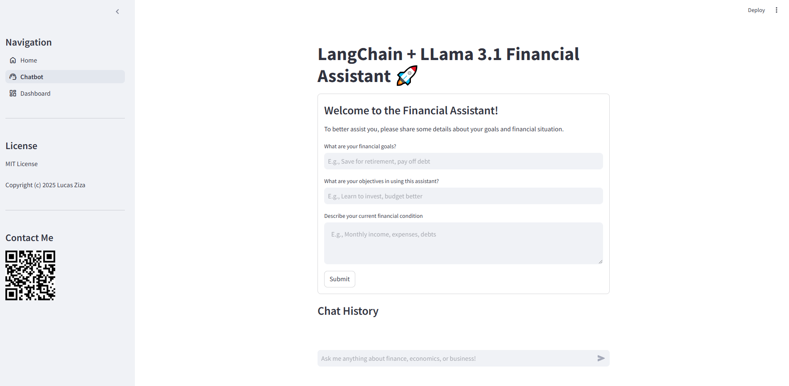
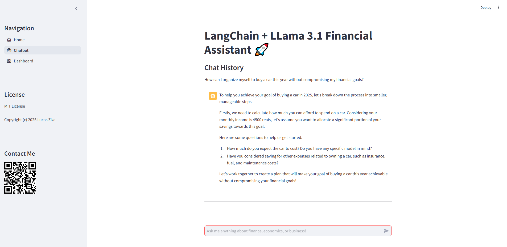
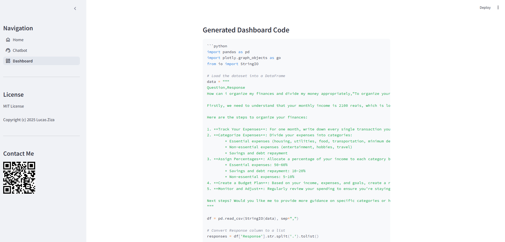

# Finance Assistent App 🚀

This Virtual Finance Assistant App is designed to simplify personal and business finance management through the power of an intelligent chatbot. This user-friendly app helps you track expenses, manage budgets, monitor savings goals, and gain valuable financial insights.

## Usage


The app features a chatbot powered by the Llama 3.1 model with 8 billion parameters. This sophisticated model is capable of understanding and assisting with various financial tasks, making it a powerful tool for users who want to manage their finances effectively. The chatbot operates locally, ensuring privacy and security for your financial data.

Key Features:
* Expense Tracking: Input your expenses and categorize them for easy tracking.
Budget Management: Set budgets and get real-time insights on your spending.
Savings Goals: Monitor your progress towards financial goals and receive personalized tips.
* Financial Insights: Ask the chatbot for advice on financial strategies and investment options.
How It Works:



* Interact with the Chatbot: Simply type your questions or requests related to finance, and the chatbot will provide detailed answers and suggestions. For example, you can ask about creating a budget, managing debts, or calculating savings over time.




* Data Handling: All interactions with the chatbot are processed locally, so you can be assured that your financial data remains private and secure.

* Local Setup: The chatbot uses the Llama 3.1 model, which runs locally on your machine, allowing for faster responses and a seamless user experience without relying on external servers.
* Automatic Dashboard Generation: Conversations with the chatbot are used by an intelligent agent to automatically generate financial dashboards. This feature analyzes your interactions and creates insightful visualizations, helping you make informed decisions based on your financial data.



This app provides a quick and easy way to improve your financial literacy and make informed decisions for both personal and business finances.

## Install

The project was created using Python 3.10. It is recommended to use the Miniconda framework for package management. Follow the steps below to set up the virtual environment required for this project:

1. Create a new environment with Python 3.10:

```
conda create -n <name of your environment> python=3.10
```

2. Activate the environment:

```
conda activate <name of your environment>
```

3. Install the required packages by running:

```
pip install -r requirements.txt
```

Additionally, you need to install the Llama 3.1 model using the Ollama tool. To do this, go to the website https://ollama.com/ and follow the instructions to install the Ollama tool.

Once Ollama is installed, open the command prompt and run the following command to pull the Llama 3.1 model:


```
ollama pull llama3.1
```

Finally, to run the app, use the following command:

```
streamlit run app.py
```